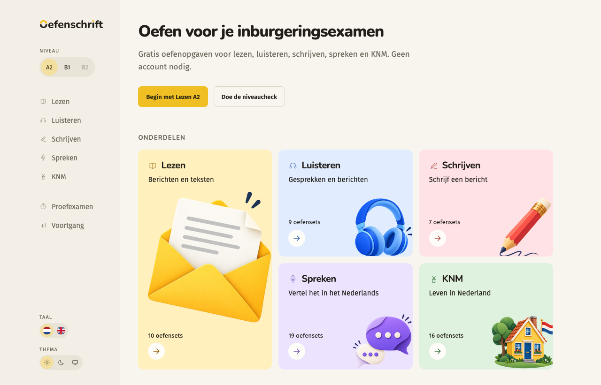

# Oefenschrift

Free, independent practice for the Dutch **inburgering** exams: reading, listening, writing and speaking at A2 and B1, plus KNM (knowledge of Dutch society). No account, no paywall; your progress stays in your browser.

**Live:** [oefenschrift.nl](https://oefenschrift.nl/)



## What you get

- **Original exercises** in short practice sets that resume where you left off. Every reading and listening answer is explained by the sentence in the text that proves it.
- **Listening** with generated Dutch audio, two native voices per conversation.
- **Writing and speaking** with feedback per point of the task (AI, bounded by the task's own criteria) or self-review; speaking with a transcript you can correct before asking for feedback.
- A **level check**, practice tests, progress on your device, Dutch or English interface, light and dark.

These are practice exercises, not official exams. Nothing here predicts a pass, and the operator panel, statistics and feedback never see your name.

## Run it yourself

```sh
npm ci
cp .env.example .env   # provider keys are optional: without them, writing and speaking offer self-review
npm run dev            # http://127.0.0.1:8766/
```

Node 24 and `ffprobe` (FFmpeg) are needed. `npm run check` runs the type, format, size, unit and build gates; `npm run test:browser` the Firefox journeys.

## Deploying

Every push to `main` runs the checks and the Firefox journeys on GitHub Actions and, when they pass, builds the site and puts it on the server (`scripts/deploy.sh` over rsync, then a service restart). The server never builds anything itself. Details: [docs/research/deployment.md](docs/research/deployment.md).

## Read on

- [Development guide](docs/development.md): configuration, commands, layout, how it works, the operations panel
- [Exercise blueprint](content/blueprint.md) and [content workflow](docs/research/content-workflow.md): how exercises are written and reviewed
- [Production hardening](docs/research/production-hardening-2026-09-10.md): limits, switches and what still needs doing before a wider launch
- [Design decisions](DESIGN.md)

## Licence

[MIT](LICENSE) for the code, the exercises, the generated audio and the illustrations. Fira Sans, Nunito and Public Sans are used under the SIL Open Font License. Official DUO material is not included.
